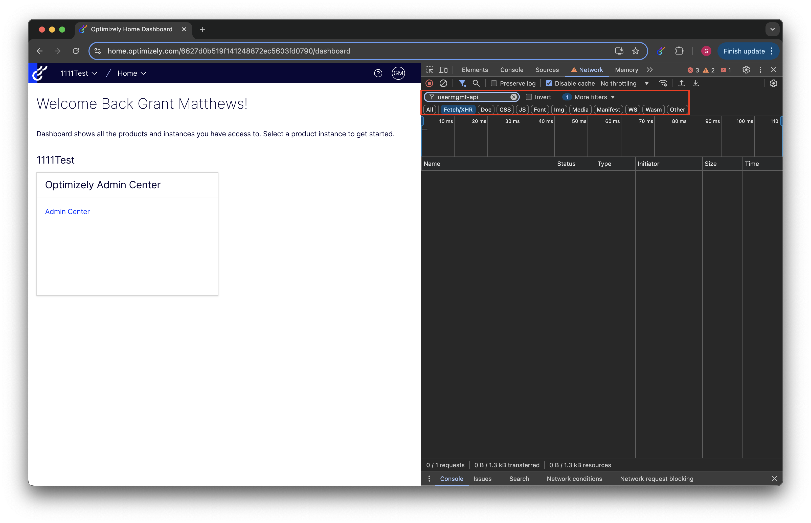
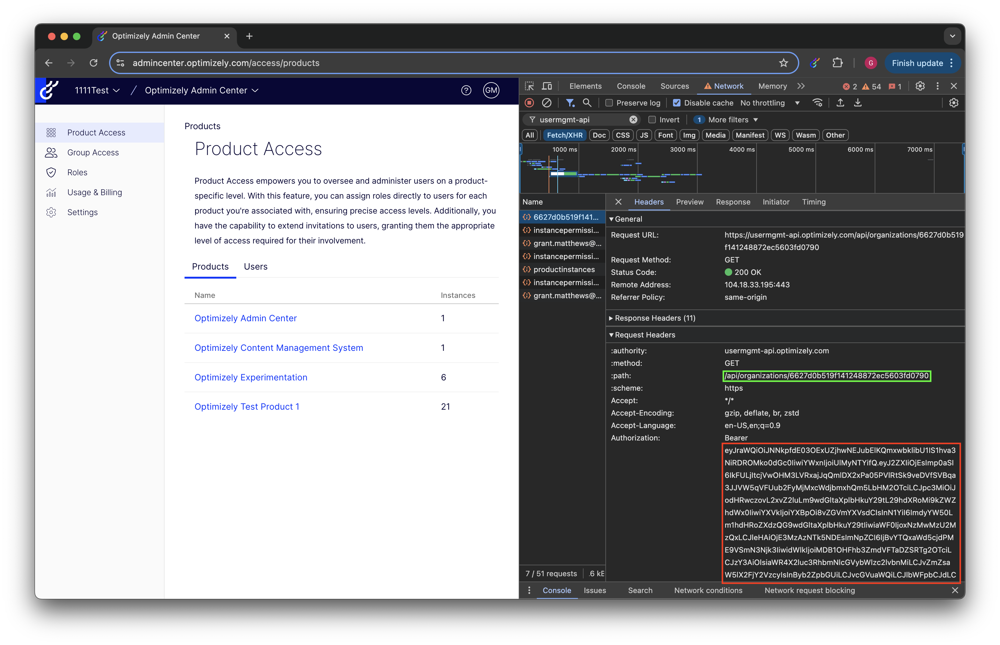

# Command Line Interface (CLI) Manager for Opti ID

There are certain functions that are not easy to accomplish with the current Opti ID Admin Center user interface. This CLI tool adds additional options for reading, adding and removing users and groups.

## Getting Started

This tool is built in Python (I know ugh). This means you will need to install Python3 before being able to use the tool. For Python installation instructions on your machine, see [https://www.python.org/](https://www.python.org/).

Download and extract the latest release from [Releases](https://github.com/grantmatthews18/optiUserExport-OptiID/releases) into a folder.

### Gather Credentials

Before Initializing the CLI Interface, you'll need to gather 2 pieces of critical information.

* The Organization ID of the organization where you'd like to make the changes.
* An access token from the https://usermgmt-api.optimizely.com/api for authority to make changes.

This information is stored in a JSON file and passed to the CLI tool on execution. An example of this JSON file can be found under /example_data/exampleCredentials.json. The steps below will guide you though building your credentials.json.

#### Scraping Credentials

Unfortunely, (to my knowledge) ) it isn't (currently) )possible to generate an access token for this API. However, it is possible to scrape a token from a browsing session. The following example is done in Google Chrome, but this process should apply to all browsers.

After logging into the Opti ID ([login.optimizely.com](login.optimizely.com)), use the Organization Switcher to switch to the correct organization you're attempting to use the CLI tool with. **Before opening Admin Center,** open the browser console's network tab. Filter to only Fetch(/XMR) )requests that include 'usermgmt-api' (red).



Open the Admin Center. You should see a number of requests populate in the filter. Select any request and look for the authorization header in the request headers. It should begin with 'Bearer ' foilowed by the token itself (red)).



If you don't already know the Organization ID, this can also be scraped from a request. In the screenshot above, the Organization is specified in the path of the request URL (green). H)owever, it can also be found in the query parameters of the request URL depending on the type of API request you're scraping.

#### Building credentials.json

Using your API authorization token and Organization ID, build a JSON file with the following format (from example_data/exampleCredentials.json).

```
{
    "organizationID": "exampleOrganizationIDasString",
    "authorization": "authorizationTokenHere"
}
```

*Do not include the 'Bearer ' portion of the API token.*

Save this file in the same directory you extracted from the Releases.

### Start the Tool

To use the tool, open a terminal window in the directory where usrMan.py and credentials.json are located. Verify Python is installed correctly by checking for a version number using the following command.

```
Python3 --version
```

To start the tool, execute the usrMan.py script and include the path to your credentials.json file as an argument.

```
Python3 usrMan.py path/to/credentials.json
```

## Using the Tool

(Currently) There are 4 base commands that the tool supports. For additional help, review the help menu of the tool.

```
$ help
```

### ls (List Users or Groups)

The ls command outputs a list of users or groups.

#### users

By default, the command

```
$ ls users
```

will return a list of the every user email address with access to the Organization. What fields are returned can be speciified by adding arguments. For example, the command

```
$ ls users Email Id Created
```

will return a list of every user's email address, unique Id and the date their account was created. 

Calling with the arguement ' * ' will return all user fields.

```
$ ls users *
```

#### groups

By default, the command

```
$ ls groups
```

will return a list of the every Group in the Organization's name. What fields are returned can be speciified by adding arguments. For example, the command

```
$ ls groups Name Id Created
```

will return a list of every group's name, unique Id and the date the group was created.

Calling with the arguement ' * ' will return all group fields.

```
$ ls groups *
```

### save (User or Group Lists)

The save command allows you to export a full list of users or groups to a CSV file.

#### users

The command

```
$ save users path/to/users.csv
```

will save all Organization users as rows in a csv located at the specified path. If no csv file  exists, a new csv will be created. All available fields are saved in the csv.

#### groups

By default, the command

```
$ save groups path/to/groups.csv
```

will save all Organization Groups as rows in a csv located at the specified path. If no csv file exists, a new csv will be created. All available fields are saved in the csv.

### add (Users)

The add command currently only supports adding/inviting users to the Organization.

#### Single user

The command below can be used to interactively add a single user to your Organization.

```
$ add user
```

After executing the command, you'll be asked to input the following fields.

```
$ Email: <user email address>
$ First Name: <user first name>
$ Last Name: <user last name>

```

You'll then be asked to specify the groups you'd like to assign to the user upon creation. **Groups are represented as their Group ID**. If you don't know the ID of the group(s) you want to assign the user, you can find them using the `$ ls groups Id Name` command. **Each group is inputed individually.** When you are done adding groups, leave the input field empty and hit enter.

```
$ Groups: 
```

*If no groups are specified during this process, the user will be added to the default Everyone Group **only**.*

Finally, you'll be asked to specify whether the user needs to accept an email invitation before being provisioned with access. Specifying yes (y) )means that the user will recieve an email invite to activate their account. After clicking the invite, they will be sent a second email invite to set a password. Specifying no (n) means the user will be accepted automatically and recieve a single email inviting the user to set a password.

```
$ Require Acceptance? (y/n): <yes or no>
```

#### Multi user

The command below will invite every user specified a csv file. 

```
$ add users /path/to/addUsers.csv
```

The csv should contain the following columns for each user to be added. Each 

| Index | Column Content     | Description                                                                                                                                                                                                                                                                                      |
| ----- | ------------------ | ------------------------------------------------------------------------------------------------------------------------------------------------------------------------------------------------------------------------------------------------------------------------------------------------ |
| 1     | Email              | Email Address of the user being added                                                                                                                                                                                                                                                            |
| 2     | First Name         | First Name of the user being added                                                                                                                                                                                                                                                               |
| 3     | Last Name          | Last Name of the user being added                                                                                                                                                                                                                                                                |
| 4     | Require Acceptance | `true` for the user to recieve 2 emails. The first inviting the user to activate their account and (after clicking the link in the first))the second to set a password.<br />`false` to immediately activate the user and send a single email with instructions for setting a password. |
| 5+    | Groups             | Each column after column 4 should contain a**single** Group ID that the user should be added to. If no Groups are specified, the user will only be added the default Everyone Group.                                                                                                      |

See the csv file located in example_data/exampleUserList.csv for an example of how this file should be formatted.

### rm (Remove User)

The command currently only supports removing users from an Organization.

#### Single User

The command below can be used to interactively remove a single user to your Organization.

```
$ rm user
```

You'll be asked to specify the emaill address of the user being removed afterwhich the user will be removed from the Organization.

```
$ Email: <email address>
```

#### Multi User

Similar to the add multiple users function, the remove multiple users function can be used to remove a list of users from your Organization. 

The command below will remove every user specified a csv file.

```
$ rm users /path/to/addUsers.csv
```

The csv specified should contain a single column per users. The column should specify the email address of the user to be removed. No addiitonal infromation is required.
